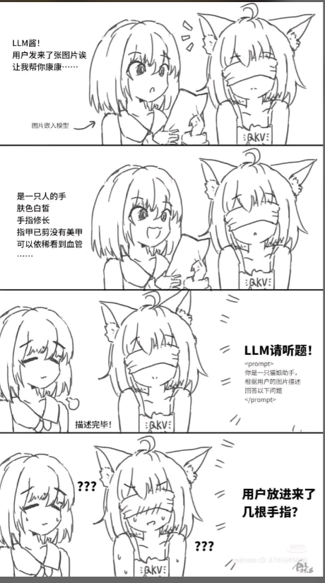

# 图片重看（MaiBot Image Relook）

当首遍图片描述不够用时，按**当前问题**重新调用 VLM 看图。向 planner 暴露 `inspect_image` 工具。

## 解决什么问题

MaiBot 默认会先把图片转成一段文字描述再给文本模型用。描述一旦漏掉关键细节（数量、文字、颜色、位置），后面就补不回来——就像下面这张梗图：



本插件让 planner 在需要时**带着具体问题再看原图**，而不是只靠第一次摘要。

## 兼容性

声明兼容 MaiBot **1.0.0 ~ 1.99.99**（SDK **2.5.1 ~ 2.99.99**），覆盖 1.x 全系列。

已按 1.x 插件运行时 / Manifest v2 / Tool + `llm.generate` 多模态消息约定实现，适配包括但不限于：

| MaiBot | 说明 |
|--------|------|
| 1.0.0 | 正式版起点 |
| 1.0.1 | Host 兼容策略放宽 |
| 1.0.2 | 1.0 小版本 |
| 1.0.3 | 1.0 小版本 |
| 1.0.4 | 1.0 小版本 |
| 1.0.5 | 1.0 小版本 |
| 1.0.6 | 1.0 小版本 |
| 1.0.7 | 1.0 小版本 |
| 1.0.8 | 学习与 Maisaka 更新 |
| 1.0.9 | 1.0 小版本 |
| 1.0.10 | 1.0 小版本 |
| 1.0.11 | 1.0 小版本 |
| 1.0.12 | 1.0 小版本 |
| 1.1.0 | 1.1 系列 |
| 1.1.1 | 1.1 小版本 |
| 1.1.2 | 1.1 小版本 |
| 1.1.3 | 实测加载 / 私聊调用 |
| 1.1.4 | 当前上游最新 |

> 实际依赖：已配置可用的 `[model_task_config.vlm]`（`visual = true` 的多模态模型）。

## 功能

- Tool：`inspect_image`
  - `question`：要对图片问的具体问题（必填）
  - `image_index`：从最近往前第几张图，默认 `1`
  - `msg_id`：可选，优先看某条消息里的图
- 消息里只有 hash、没有内嵌字节时，会从 `data/images/<hash>.*` / Images 表补读原图
- 工具默认 `visibility=visible`，便于 planner 直接看见

## 安装

1. 把本仓库放到 MaiBot 的 `plugins/` 目录，例如：
   `plugins/github_kumburovicbranko682-boop_image-relook/`
2. 或在 WebUI 插件中心 / 官方插件仓库安装（收录后）
3. 重启 MaiBot，日志出现：`图片重看插件已加载`

## 配置

运行时由 Runner 根据 `config_model` 生成 `config.toml`。常用项：

```toml
[plugin]
enabled = true
config_version = "1.0.2"

[relook]
lookback_hours = 24.0
recent_message_limit = 40
max_images = 10
llm_task = "vlm"
temperature = 0.2
max_tokens = 1024
```

| 配置 | 默认 | 说明 |
|------|------|------|
| `relook.lookback_hours` | `24` | 向前找图的小时数 |
| `relook.llm_task` | `vlm` | 识图任务名 |
| `relook.temperature` | `0.2` | 重看温度 |

## 使用方式

一般不用手打命令。用户发图并追问细节时，planner 应调用 `inspect_image`。

示例：

1. 用户发一张手掌图：「看得见吗」
2. 用户追问：「掌纹有几条」
3. planner 调用 `inspect_image(question="这张手掌图上有几条掌纹？")`
4. 工具带问题重跑 VLM，把观察结果交回 planner / replyer

## 能力声明

- `message.get_recent`
- `llm.generate`
- `database.get`
- `database.query`

## 故障排查

| 现象 | 可能原因 |
|------|----------|
| 工具返回找不到图片 | 会话 ID 不对；图超出 lookback；图片文件已被清理 |
| 识图失败 | VLM 未配置 / 模型 `visual=false` / 上游报错 |
| planner 不调用工具 | 确认插件已加载；工具描述是否可见；是否被 tool_search 延迟发现（本插件已设 visible） |

## License

MIT
